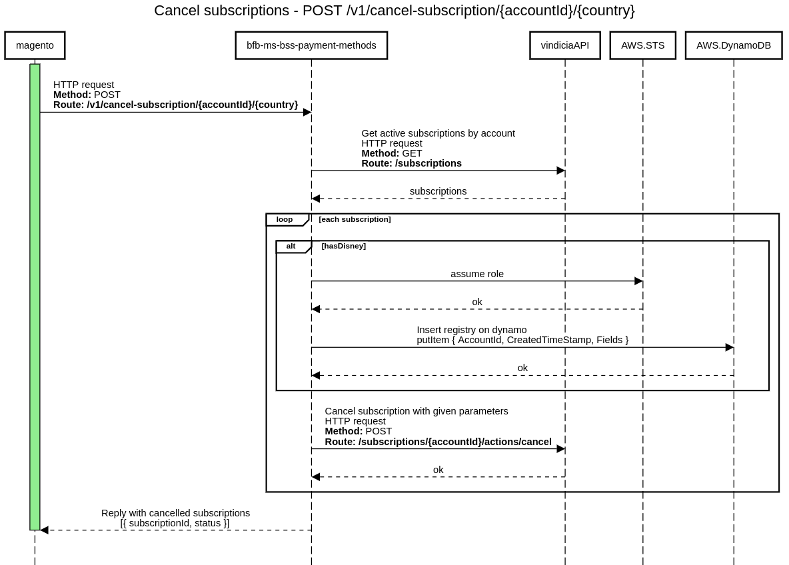
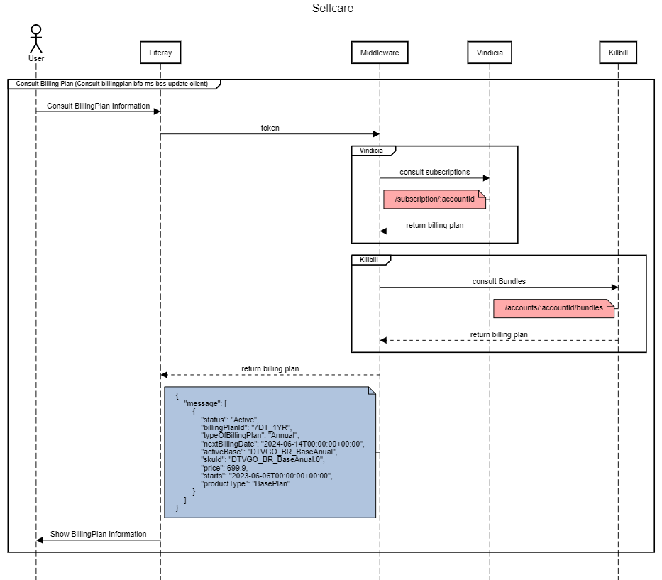
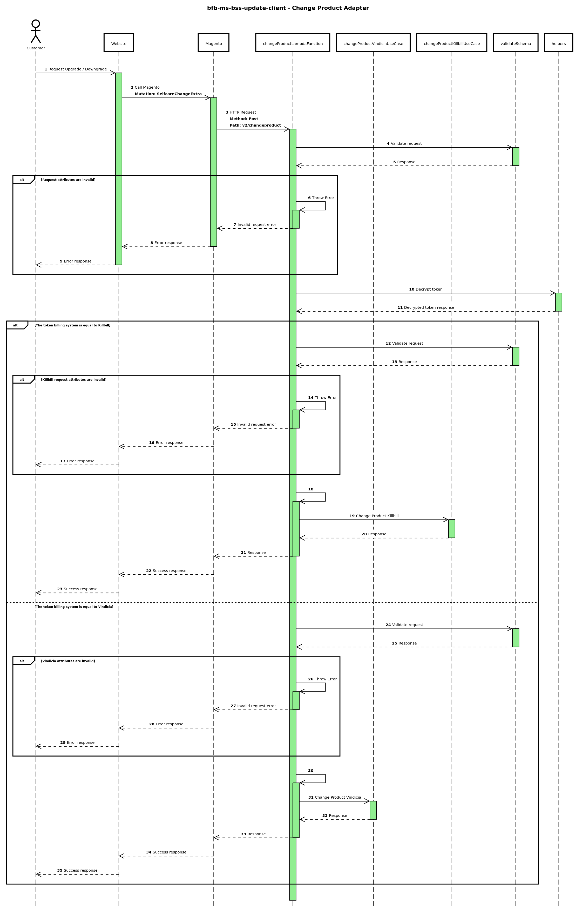

# What is Update Client??

This microservice was developed so that the user can make some changes in the account/subscription, such as: change a plan, insert or remove a product, add a discount coupon or check some data in the account/subscription.

## Requirements

- **Node.js** version 18.0 or above
- When installing Node.js, ensure you check all dependency-related options.
- **Serverless Framework**: Used for serverless implementation.

## Routes

### V1 POST cancelSubscription

route responsible for canceling subscription

#### Sequence Diagram



### V2 GET  consultBillingPlan

route responsible for consult Billing Plan

#### Sequence Diagram


    
### V2  POST changeProduct

route responsible for Change product (Upgrade and Downgrade)



## How to run the project

#### Run Application
How to run the application
```bash
npm start
```

#### Run Tests 
How to run the tests
```bash
npm run test
```

